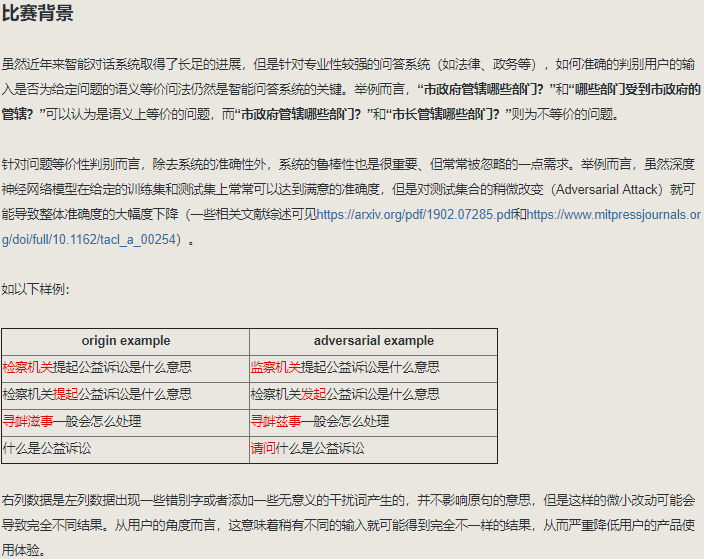
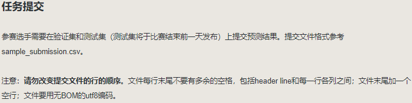
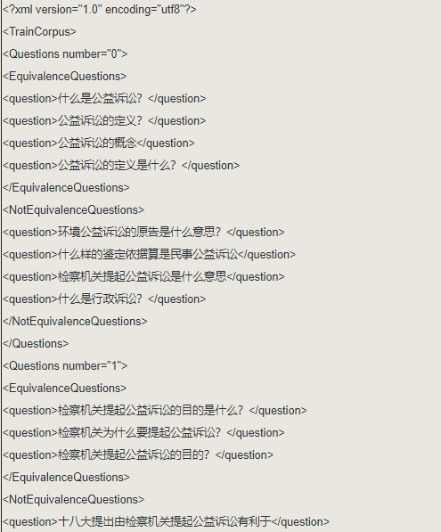

# 2019-Biendata-Problem-Equivalence-Discrimination-Game-Based-On-Adversarial-Attack
2019 Biendata 基于Adversarial Attack的问题等价性判别比赛

1. 对抗样本可能是一句话中出现一些错别字或者无意义字词等方式生成的.
2. 添加无意义字词的一般并不会改变原问题的语义.
3. 出现错别字或者不同字的,如果通过语义,能容易判断出真实想说的词或意思的,认为语义没有改变.
4. 最终的测试数据集中包含50%的对抗样本.
5. NotEquivalenceQuestions标签内的问句相互之间可能是等价的,也可能是不等价的.

## 参考

1、https://github.com/makcedward/nlpaug

2、https://github.com/FreeFlyXiaoMa/adversarial_attack

### [图特征]
3、https://www.kaggle.com/tour1st/magic-feature-v2-0-045-gain/notebook

### data leak [数据泄漏]